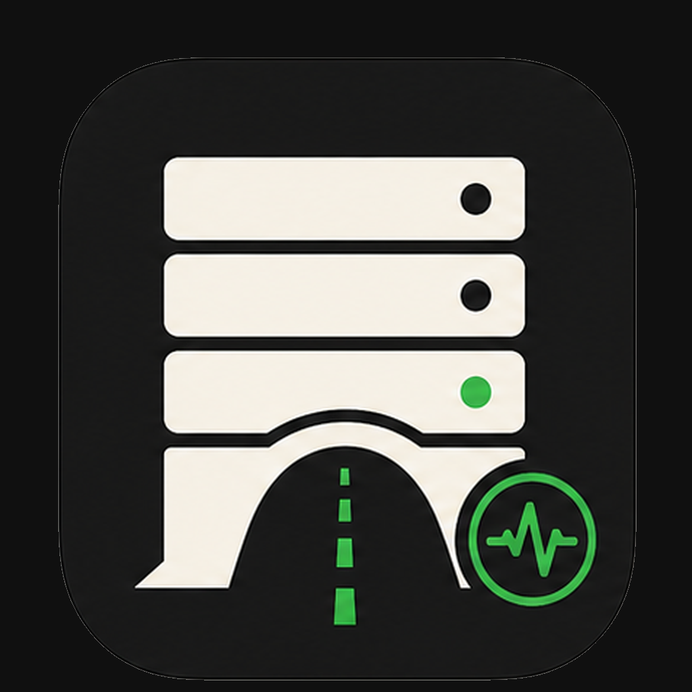
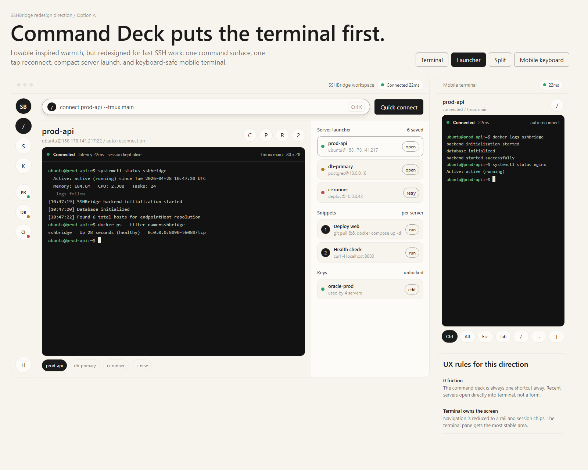
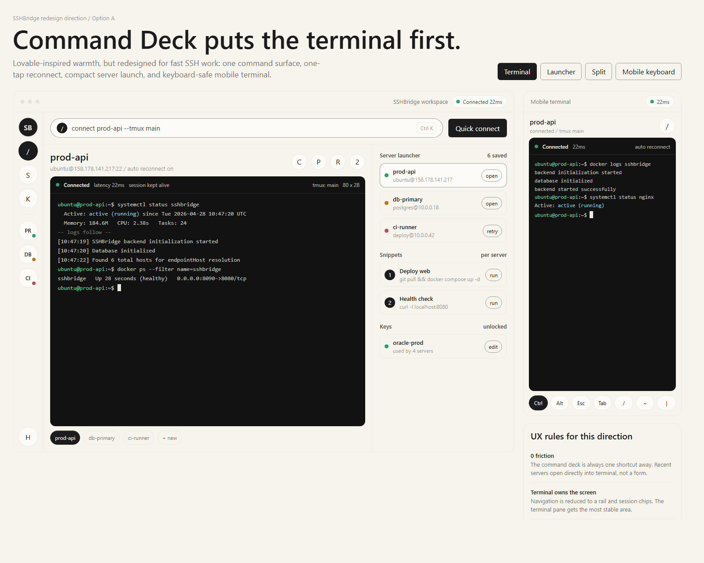
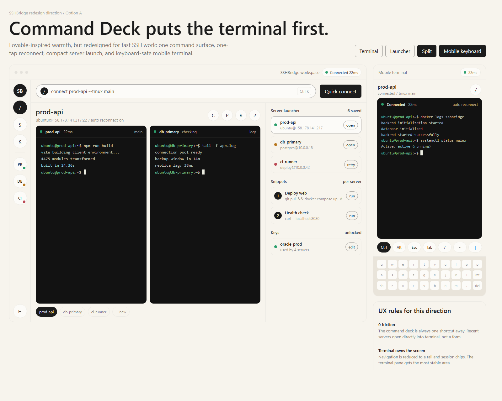

# SSHBridge Web

<p align="center">
  
</p>


SSHBridge Web is a self-hosted server workspace built around a fast SSH
terminal. It keeps saved servers, tabs, files, tunnels, stats, and remote access
tools in one browser-based command deck.

The current UI is terminal-first: open the app, pick a server, and get back to
work with minimal friction.

<p align="center">
  
</p>

## Core Experience

- **Server launchpad**: search, filter, and open saved servers quickly.
- **Terminal workspace**: browser-style tabs, split sessions, xterm.js,
  command autocomplete, snippets, history, copy/paste, and persistent session
  recovery.
- **Fast status feedback**: status badges refresh quickly, with manual refresh
  and lightweight retry behavior.
- **File manager**: browse, edit, upload, download, rename, move, and delete
  files over SSH.
- **Tunnels**: create and manage local and remote SSH port forwards.
- **Remote desktop**: RDP, VNC, and Telnet through Guacamole when enabled.
- **Server stats**: CPU, memory, disk, network, uptime, firewall, and port
  monitor views for Linux hosts.
- **Admin controls**: local users, roles, sharing, OIDC, TOTP, sessions, and
  database security.
- **Mobile web layout**: compact navigation, terminal controls, and keyboard
  helpers for smaller screens.
- **Desktop builds**: Electron packaging for Windows, macOS, and Linux.

<p align="center">
  
  
</p>

## Quick Start

Prerequisites:

- Node.js 20 or newer
- npm
- Docker, if you want the containerized deployment

Install dependencies:

```sh
npm install
```

Run the frontend:

```sh
npm run dev
```

Run the backend in another terminal:

```sh
npm run dev:backend
```

Open the Vite app at the URL printed by the dev server.

## Docker

A minimal Docker Compose setup:

```yaml
services:
  sshbridge:
    image: ghcr.io/nghoang1288/sshbridge:latest
    container_name: sshbridge
    restart: unless-stopped
    ports:
      - "8080:8080"
    volumes:
      - sshbridge-data:/app/data
    environment:
      PORT: "8080"
    depends_on:
      - guacd

  guacd:
    image: guacamole/guacd:1.6.0
    container_name: guacd
    restart: unless-stopped

volumes:
  sshbridge-data:
```

If you do not use RDP/VNC/Telnet, you can omit `guacd`.

## Production Build

Build the web app and backend TypeScript:

```sh
npm run build
```

Type-check only:

```sh
npm run type-check
```

Lint:

```sh
npm run lint
```

## Repository Layout

- `src/backend`: API, database, SSH, stats, tunnels, Guacamole, and auth.
- `src/ui/desktop`: desktop web workspace.
- `src/ui/mobile`: mobile web workspace.
- `src/ui/desktop/apps/features/terminal`: xterm.js terminal experience.
- `docker`: Docker and nginx deployment configuration.
- `public`: PWA, favicon, and app icon assets.

## Security Notes

- Use HTTPS in production, especially when using password-based SSH login.
- Keep database files and backups private.
- Rotate SSH credentials if a server, browser profile, or backup is exposed.
- Report vulnerabilities through
  [GitHub Security Advisories](https://github.com/nghoang1288/SSHBridge-Web/security/advisories).

## Support

Use [GitHub Issues](https://github.com/nghoang1288/SSHBridge-Web/issues) for
bugs and feature requests.

## License

Distributed under the Apache License Version 2.0. See [LICENSE](./LICENSE).
